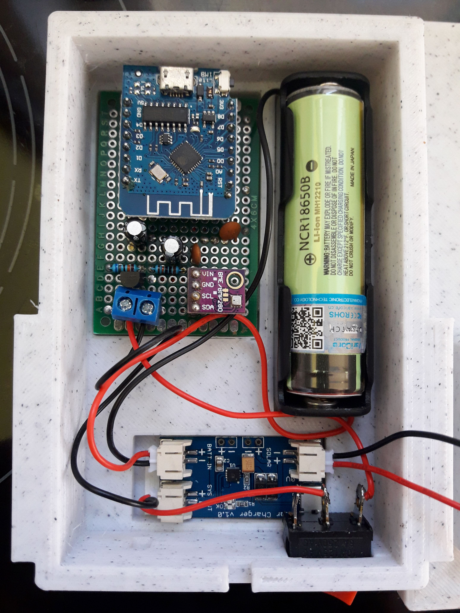

## SolarWeatherBox
  **Iot Weather sensor with solar power and sending the data to an MQTT server.***

   

   

   

   

   

   

   

   

   

### Description

### Disclaimer
   I don't take any responsibility nor liability for using this software nor for the 
   installation or any tips, advice, videos, etc. given by any member of this site or any related site.

### License
   This program is licensed under GPL-3.0

### Source Code
  The software is the same as Snorktracker with #undef SIM808_CONNECTED 

### Shopping list
Here are some sample shopping items. Please check the details if everything is correct.

|Label              |Price      |Sample URL        |
|-------------------|-----------|------------------|
|Switch             |1€         | https://www.bastelgarage.ch/kippschalter-on-off-schalter-6a-125v-3a-250v?search=schal |
|WeMos D1 Mini lite |7€         | https://www.amazon.de/1-0-0-WIFI-Internet-Things-Development-ESP8285/dp/B07JBK1SWQ |
|BME280             |6€         | https://www.amazon.de/AZDelivery-GY-BME280-Barometrischer-Temperatur-Luftfeuchtigkeit/dp/B07FS95JXT/ref=sr_1_1_sspa |
|Li-Ion Akku        |12€        | https://www.bastelgarage.ch/li-ion-akku-3000ma-18650-mit-schutzelektronik-und-stecker |
|Solar Set          |19€        | https://www.bastelgarage.ch/solar-set-2w-lolin32-mit-laderegler-fur-lipo-akku |

